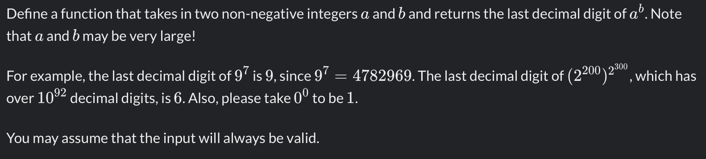

# Last digit of a large number
5 kyu
[link to kata](https://www.codewars.com/kata/5511b2f550906349a70004e1/train/javascript)
<br>
[my solution](./kata.js)



Examples
```
lastDigit("4", "1")            // returns 4
lastDigit("4", "2")            // returns 6
lastDigit("9", "7")            // returns 9    
lastDigit("10","10000000000")  // returns 0
```

Define a function that takes in two non-negative integers 
a
a and 
b
b and returns the last decimal digit of 
a
b
a 
b
 . Note that 
a
a and 
b
b may be very large!

For example, the last decimal digit of 
9
7
9 
7
  is 
9
9, since 
9
7
=
4782969
9 
7
 =4782969. The last decimal digit of 
(
2
200
)
2
300
(2 
200
 ) 
2 
300
 
 , which has over 
1
0
92
10 
92
  decimal digits, is 
6
6. Also, please take 
0
0
0 
0
  to be 
1
1.

You may assume that the input will always be valid.